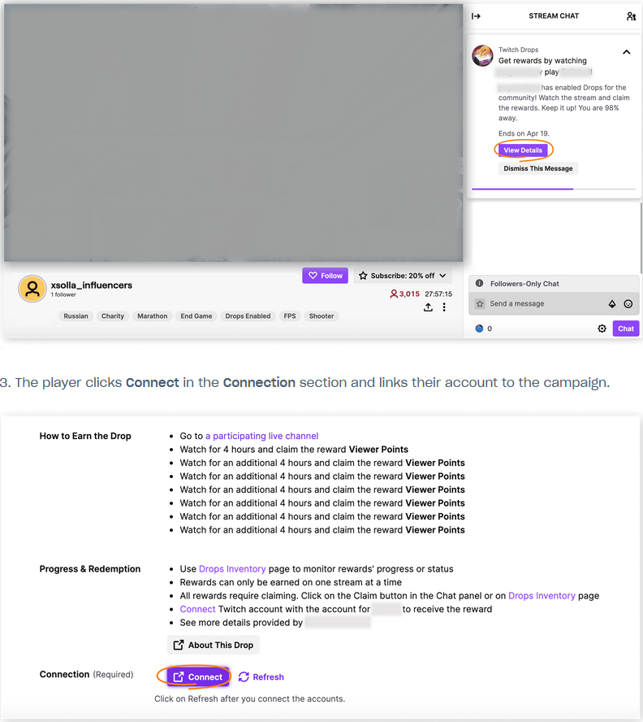
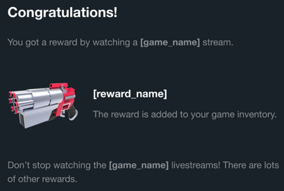

| Highlights | :---: | 
| ---: | :--- |
| | |
| Monetization: | Sell anything, anywhere | 
| Subscriptions: | Easy-to-manage recurring revenue source |
| Gateway Subscriptions | :---: |  
| Cross-platform | Subscribers |
| Publishing: | Expanded solutions for global growth |
| Global Distribution Solution | :---: |
| Multi-Platform Publishing Solution | :---: | 
| Accelerate Your Growth: | Influencers Solution |
| Creator Tag Programs | :---: |
| Business Engine 101: | Access Account Publishing |
|  |  | 

     

# Hit up a singer to solo on a track. Hire a hot beat.
## Finally make polished sound tracks like a mac.  Find a mic so clear good never sounded like that.  

Merch makers and managers that make moves, ***make racks***.  

Services to find and great productions.  All on the crypto block so you won't have to pay no mind.  People will love what you do, labels never define that.  Listen anytime. Do you have the talent we all want to hear?  Now is the time. What will you publish?  Listen as you want. Release as much as you want. 
#### ***Turn up whenever***  
  
Even without anything to publish users will always find something they love hearing.  Best platform to connect where people are doing. Keep your ear out what's going down in the myMusic.Global demo stalls, product booths, recording sessions, and find live rap battles, guitar performances, siren soul singers, and emerging talent across the global spectrum of talented individuals from across the music world. Listen to local players make it global.  

> Because that's your world, that's our mission. 
> Everything for your to listen, master, and win from video, to audio on mobile.  

This is.....

## [myMusic.global](http://mymusic.global) 
### Global music that hits home right where it counts. Publish and listen to any amount. Get a crypto that counts. 

________________________________________________________________________________________________________________________

# myMusic.Global Partner Network

| Open Doors | Breakthrough | Windows of Opportunity | Like It Or | Follow Us |
| :---: | :---: | :---: | :---: | :---: |
| Become a doorway | | | | |
| Create a project | Integrate payment | Find a program | Get started with features | how-to's |   
| or expand right away into integrations | Influencer connections | Affiliate promotions | Referal Signing | Media outlet | 
| Coaches | Producers | Markets | Insight | Audiences | 
| Outreach | Guest slots |  Brand builder | Promoters | Communications |
| Insider interests | Places | Faces | Gigs | Interviews |
| Stories | Trending | Live | Watch | Listen |
| Meet n Greet | Accredidation | Journalists & bloggers | Photo ops | Public opportunities |
| Sound studios | Singers | Songwriters | Instruments/Gear | Inststramentals/Sounds |
| Stage | Equipment | Booths | Management | Promotions | Television |
| YouTube | Copyright | Hire | Search | Offers | Starting out |
| Leveling up | Hitting it big | Dialing it in | Digging into requirements | Tech/Equipment |
| Technical resources | Technicians | Teachers/Tutors | Makers | Categories |
| Tours | Insights | Advice | Fame/Fortune | The Grind/Hustle | 
| Performances/Places | Performances/Performers | Performance/Equipment | Performance/Help/Cast Crew | Play music/Listen | 
| Play Music/Performers | Play Music/App | Play Music/Businesses | Musak | Playwrite music |
| Writers | Ghost writing opportunities | The local columns | (resurrect the notorious band gig listings) | "Drummer wanted | 
| 1025 E Ave | Wed 20th 9pm | Wabash Washington | Band tryouts | Rock Music." |
 
____________________________________  

### Ted Rivera myMusic.global influence powerhouse network
##### feat. Modern Edge affiliate, developer, & promotions
--------------------------------------------------------------------------------------------------

| Animal Analytics - Pro Secret of Industry Titans |
| :---: |
| <video id="ad" width="400" height="400" controls><source src="media/Animal-analytics.mp4" type="video/mp4"></video> |

 

__________________________________________________________________________________________________

## Virtual currency, items, and keys that create opportunity to engage on every level. With global appeal.  

Engage direct sales and enable global production of authentic merchandise that audiences and creators alike appeal to.  Influence high demand while maintaining low overhead with minimal effort. Broaden horizons that are otherwise inaccessable to the most available markets means currency across labor channel, event venues, entertainment platforms.  Connect socially and make business locally for a community globally.  Massive effect and wide appeal taps into an essential part inside every individual soul.  

Bringing flavor to a scene that cooks up opportunities that are in short supply done in micro interactions to cause a wave of ferver for business interests even the least will find most attractive.  Capture, create, collect, cultivate, commoditize the currency of committment with conveniece and cap the bottle on the magic that is... 

> myMusic.Global | Crypto Creatives \
> Decentralized to keep your music at the center. \
> Without limitations on potential.

Creative community commons.  Come, collect, create, and collaborate. 

__________________________________________________________________________________________________
| Example Drop Reward Store |
| :---: |
| [Link to concept demo HERE. But dont see game items. Think music. Booths maybe, or studio bites...](https://livedemo.xsolla.com/store-demo/?_xm=3001.210077834306191398#/) |
__________________________________

Visit ***myMarket.Global*** to see sounds from across the globe from your neighborhood to ours. Make magic in whatever way you want whether you list them or listen to them.  Plug in and be involved so we all know your vision means a world of difference.  In an indifferent world, ***myMusic.Global initiative*** let's you really dive in if that's trying to break in to the industry, just taking it all in being a part of the magic, or a rising star tapping a feeling within that means something making crowds of listeners hear what you say and *feel something when they listen*.  No matter where you go with it. The passion that drives artists who make great songs, a great scene, worth a listen every time.

## Begin your jouney. Become your story.  

Bitcoin and other major currency to make your means. Listen into the scene with no commercial takeovers in between.  Settle in. **myMusic is taking listing to places you want to be**.  
Listen in, and hear a world of difference in myMusic.  Together we can all make it big. 

## Create your acount. Make your music count. Count up the crypto.

Typeform Inline Embedded Form
 

> ### Get into what your into. 
> #### Visit [ myMusic.Global ](https://xd.adobe.com/view/9501c7e4-5067-41bb-411e-19c7d1559810-e330/?fullscreen&hints=off)

## So many people love what you love too!

## [myMusic.Global](https://xd.adobe.com/view/9501c7e4-5067-41bb-411e-19c7d1559810-e330/?fullscreen&hints=off)

Copyright 2022, Wild West Films \
*privacy policy - terms and conditions*
 